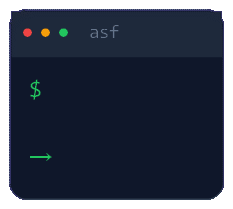

# autoshell-ai

<p align="center">
  
</p>

在终端里**直接打自然语言 → 按 Tab**，就变成一条可执行的 shell 命令（可选自动执行）。命令名是 `asf`。

- **BYOK**：DeepSeek key 只存在你自己机器上（`~/.autoshell/config.json`），不上云、不经过第三方。
- **常驻 daemon**：`asf serve` 起一个本地服务，复用 TLS 连接、RAG 检索相似命令，越用越准。
- **Agent 式探索**：模糊意图（"跑起来这个项目""打包这个项目"）时，LLM 会自主读工作区文件、理解项目上下文，再生成准确命令；明确意图（`cd`、列目录）直接出命令、不额外读文件，不拖慢补全。
- **技术栈知识库**：内置 Java / Node / Python / Rust / Go / Docker 命令模板，云端同步增补，构建 / 运行 / 测试 / 部署类意图更准。
- **匿名共享**：反馈和「验证过的命令」走云（Supabase）共享，让所有用户一起优化命令库。

## 要求

- Node ≥ 21.7

## 安装

```bash
npm i -g autoshell-ai
```

## 三步上手

1. 起服务（保持这个终端运行，会自动打开控制面板）：

   ```bash
   asf serve            # 默认自动打开 http://localhost:3000
   asf serve --no-open  # 不想自动开浏览器就加这个
   ```

2. 配 key：浏览器打开 http://localhost:3000 ，在「设置」页选 provider、填 DeepSeek key。

3. 装 Tab 钩子（PowerShell）：

   ```powershell
   asf shell-init powershell --install   # 直接写入 $PROFILE
   ```

   bash / zsh 同理：`asf shell-init bash --install` 写进 `~/.bashrc`，`asf shell-init zsh --install` 写进 `~/.zshrc`。
   （不加 `--install` 则只是打印脚本，方便你检查或手动安装。）

   重开一个终端，直接打字 + Tab：

   ```powershell
   找出大于 100M 的文件<Tab>
   ```

> 首次运行会下载一个约 90MB 的 embedding 模型（走 hf-mirror 镜像），之后常驻内存。

## 常用命令

```bash
asf serve                              # 起 daemon + 控制面板（自动开浏览器）
asf serve --no-open                    # 起服务但不开浏览器
asf "列出占用端口的进程"                 # 不装钩子，也能直接生成命令
asf "打包这个项目"                       # 模糊意图：LLM 自动读工作区识别项目类型再打包
asf config set autoExecute true        # Tab 后自动执行（默认只补全）
asf shell-init powershell --install    # 装 Tab 补全（powershell / bash / zsh）
asf shell-init powershell              # 仅打印补全脚本
```

> 模糊意图（"跑起来""打包""上线"等）时，`asf` 会自主读工作区文件（跳过 `.git` / `node_modules` / `.env` 等敏感项）判断项目技术栈，再结合内置技术栈知识库生成命令。

## 换 provider / 自定义

控制面板「设置」页支持多个 provider：内置 DeepSeek，也可自定义 baseURL + model。
